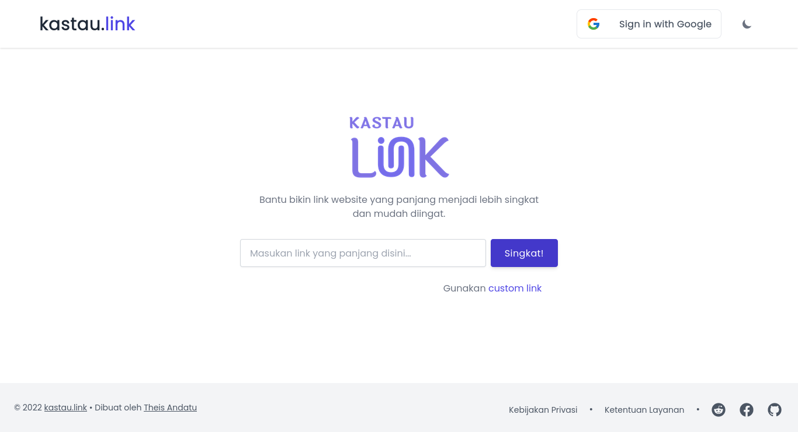

<h1 align="center">Kastau Link</h1>

Kastau Link is a website based open source project used to shorten long links into shorter and easier to remember links.

	<a href="https://kastau.link">Demo Page</a>&nbsp;&nbsp;&nbsp;
	<a href="#">Documentation Page</a>&nbsp;&nbsp;&nbsp;

## Contributing

Please follow [Contributing Guide](./CONTRIBUTING.md) before contributing.

## License

Kastau Link is under [MIT License](./LICENSE).

## Author

Kastau Link is created by <a href="https://antheiz.me">Theis Andatu</a>.

## Problem

- When the application cannot start, check your network connection maybe you're not connected to any network
- If you still have a problem create `issues` on this repository so the problem can be fixed
