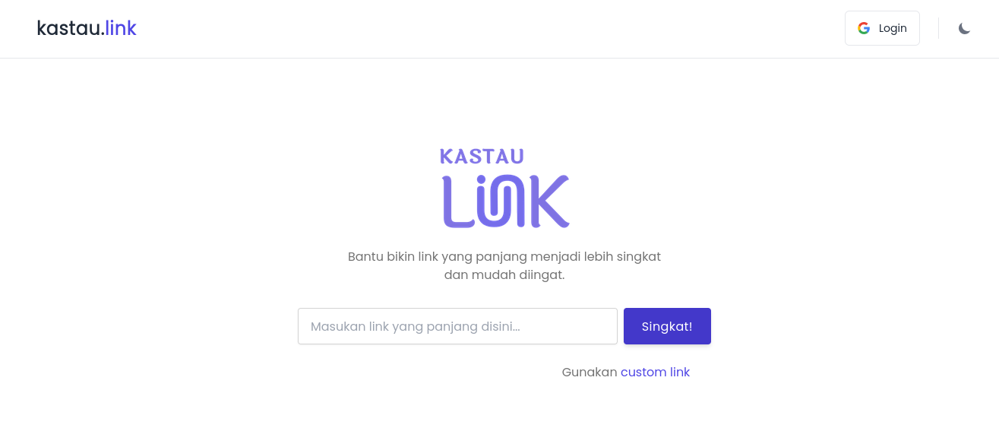

## Kastau Link

	

   
	<strong>Kastau Link</strong> is an Open Source project for make shorten urls. Made with Tailwind CSS and Flask.
    

  

## Documentation
Visit our [official documentation](https://docs.kastau.link)

## Contributing
Pull requests are welcome. For major changes, please open an issue first to discuss what you would like to change. Please follow [Contributing Guide](./CONTRIBUTING.md) before contributing.

## Can I deploy to my own domain?
The code is open for learning purpose, feel free to deploy to your own domain. 

## Author
Kastau Link is created by <a href="https://antheiz.my.id">Theis Andatu</a>.

## License
Kastau Link is under [MIT License](./LICENSE).